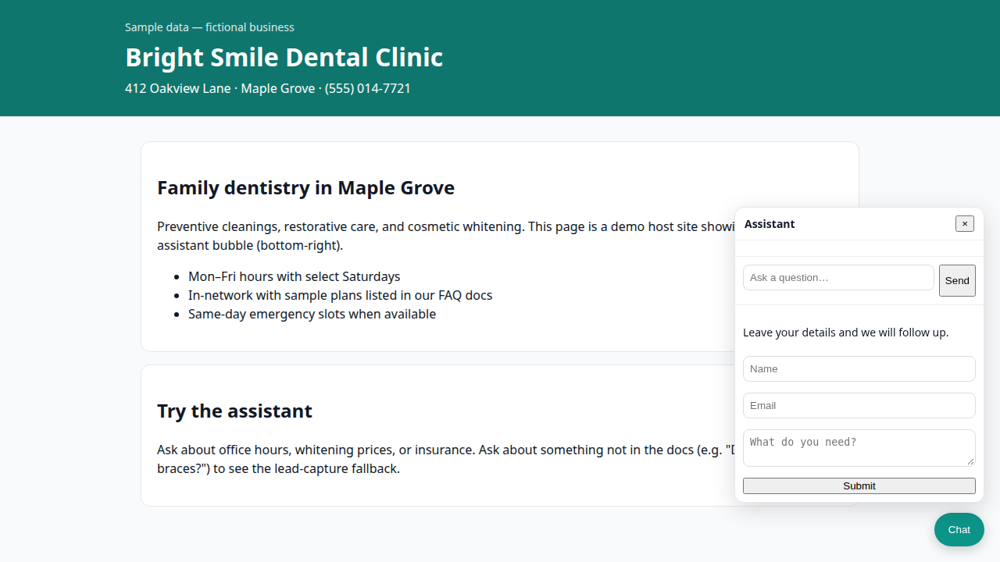
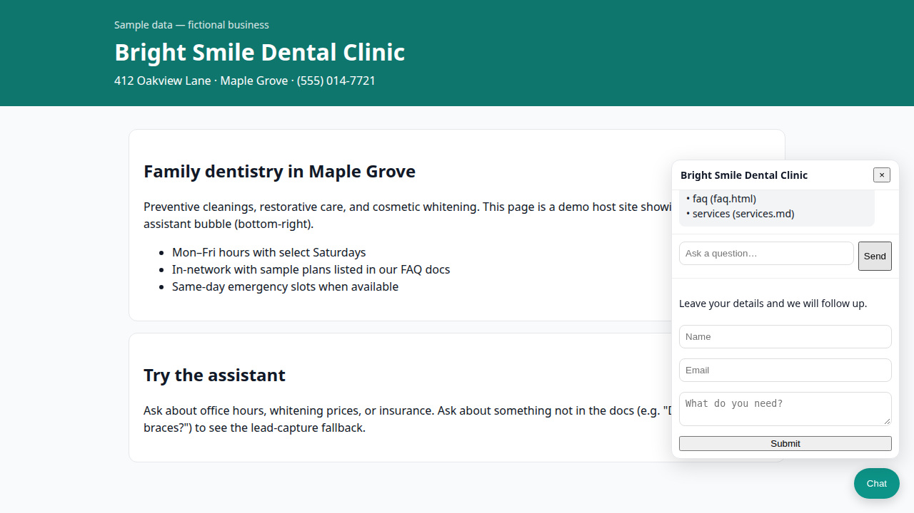
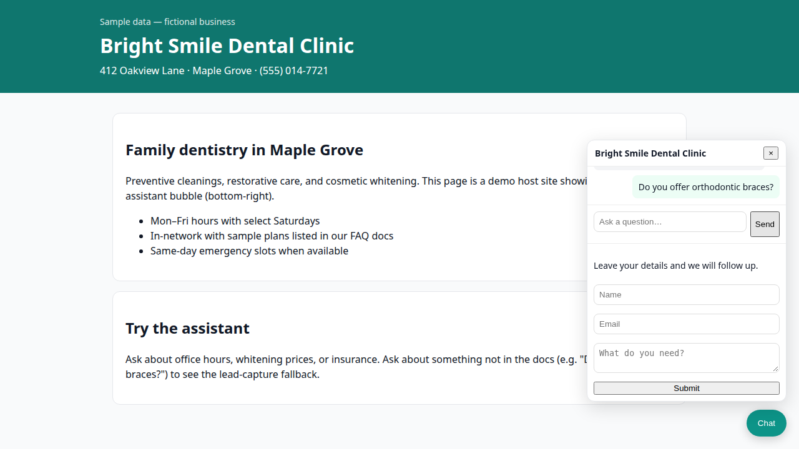
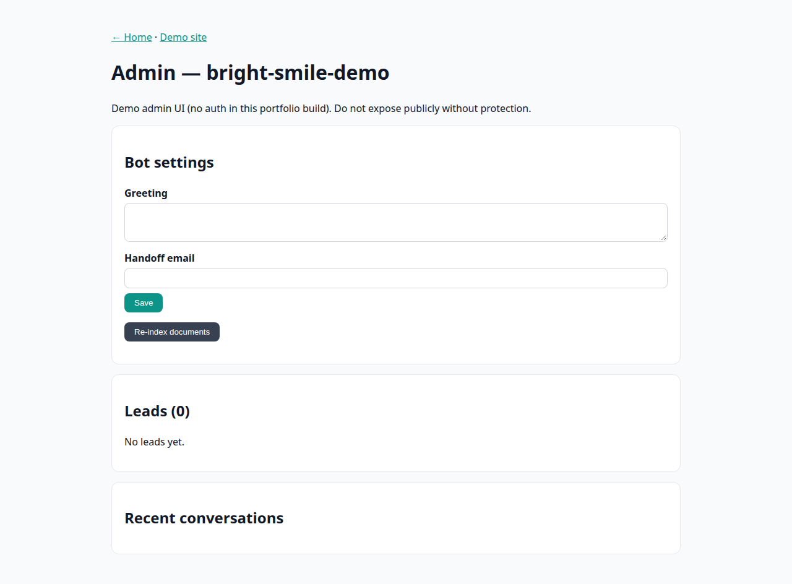

# SiteBot — Website AI Assistant (Portfolio Demo)

Small businesses get the same repetitive questions on their website: hours, pricing, insurance, booking. **SiteBot** is a embeddable chat assistant that answers **only from the company’s own documents**, cites the source, and **captures leads** when it cannot help or detects buying intent.

> **Sample business:** [Bright Smile Dental Clinic](data/sample-business/bright-smile-dental/) — entirely fictional sample data for this demo.

## Problem

- Visitors leave when they cannot find answers quickly.
- Owners cannot staff live chat 24/7.
- Generic chatbots invent facts; SiteBot is doc-grounded and refuses to guess.

## Features

| Area | Behavior |
|------|----------|
| **Knowledge** | Ingest Markdown, PDF, HTML, and plain text into a local retrieval index |
| **Answers** | Offline BM25-style search (MiniSearch) + templated excerpts with **source citations** |
| **LLM (optional)** | Set `LLM_BASE_URL`, `LLM_API_KEY`, `LLM_MODEL` for OpenAI-compatible APIs |
| **Honesty** | Low-confidence or missing docs → “I don’t know” + lead form |
| **Leads** | Name, email, need; email validation; **SQLite + CSV** by default |
| **Integrations** | Pluggable **Google Sheets** and **HubSpot** adapters (disabled by default) |
| **Embed** | One script tag adds a chat bubble |
| **Admin** | Conversations, leads, re-index, edit greeting & handoff email (HTTP Basic when `ADMIN_PASSWORD` is set) |
| **Safety** | Rate limits, injection-resistant LLM system prompt, no secrets in widget, CORS allowlist |

## Screenshots

| Demo site + widget | Answered question | Lead fallback | Admin |
|--------------------|-------------------|---------------|-------|
|  |  |  |  |

## One-line embed

```html
<script src="https://YOUR-DEPLOYED-HOST/widget.js" data-bot-id="bright-smile-demo"></script>
```

Locally:

```html
<script src="http://localhost:3000/widget.js" data-bot-id="bright-smile-demo"></script>
```

## Run locally (~2 minutes, fully offline)

```bash
npm install
npm run demo
```

- App: [http://localhost:3000](http://localhost:3000)
- Sample business site with widget: [http://localhost:3000/demo](http://localhost:3000/demo)
- Admin: [http://localhost:3000/admin](http://localhost:3000/admin)

`npm run demo` builds the retrieval index and starts Next.js. **No API keys required.**

### Admin access

| `ADMIN_PASSWORD` | Behavior |
|------------------|----------|
| **Unset** (default for public demo) | `/admin` is **read-only demo mode**: sample leads/conversations only, no settings or re-index writes |
| **Set** | `/admin` and `/api/admin/*` require **HTTP Basic** auth (any username, password = `ADMIN_PASSWORD`); real leads and writes enabled |

Do not expose a password-protected admin on the public internet without TLS (Vercel provides HTTPS).

### Tests

```bash
npm test
```

### Regenerate screenshots (Playwright)

```bash
npx playwright install chromium
npm run screenshots
```

## Load your own documents

1. Copy `data/bots/bright-smile-demo.json` to a new bot id (e.g. `my-shop.json`).
2. Point `docsPath` at your folder of `.md`, `.txt`, `.html`, `.pdf` files.
3. Run `BOT_ID=my-shop npm run ingest`.
4. Embed with `data-bot-id="my-shop"`.
5. Add your site origin to `allowedOrigins` in the bot JSON (or set `ALLOWED_ORIGINS` env var).

Re-index from the admin UI or:

```bash
curl -X POST http://localhost:3000/api/admin/reindex -H 'Content-Type: application/json' -d '{"botId":"bright-smile-demo"}'
```

## Optional LLM mode

```bash
export LLM_BASE_URL=https://api.openai.com/v1
export LLM_API_KEY=sk-...
export LLM_MODEL=gpt-4o-mini
npm run demo
```

Answers still use retrieved passages in the prompt; the system instructions forbid hallucination.

## Lead storage & CRM / Sheets

**Default:** `data/leads.db` (SQLite) and append-only `data/leads.csv`.

**Google Sheets (off by default):** see [docs/integrations/google-sheets.md](docs/integrations/google-sheets.md)

**HubSpot (off by default):** see [docs/integrations/hubspot.md](docs/integrations/hubspot.md)

## Deploy to Vercel (free tier)

1. Import this repository in Vercel (Next.js detected; `vercel.json` included).
2. Leave **`ADMIN_PASSWORD` unset** for the portfolio demo (read-only admin with sample data).
3. Set `ALLOWED_ORIGINS` to your customer sites (comma-separated URLs). Vercel preview/production URLs are added automatically.
4. Optional: LLM and lead sink env vars from `.env.example`.
5. Deploy. Use `https://<project>.vercel.app/widget.js` in the embed snippet.

**Vercel notes:**

- **Retrieval index:** `npm run build` runs ingest and commits/updates `data/index/` — search works on serverless without runtime writes.
- **Leads:** On Vercel, lead capture still returns success to the widget but uses **in-memory storage** (not durable). The API may include a `persistenceNote` explaining this. For production, enable Sheets/HubSpot sinks or a hosted database.
- **Re-index:** Disabled at runtime on Vercel (read-only filesystem); rebuild/redeploy to refresh documents.

## Project layout

- `public/widget.js` — embeddable bubble (no secrets)
- `data/sample-business/` — fictional Bright Smile docs
- `data/index/` — generated retrieval index (created by `npm run ingest`)
- `src/app/api/` — chat, leads, widget config, admin APIs
- `src/lib/` — ingestion, retrieval, offline/LLM answering, lead store

## License

MIT (portfolio demo).
